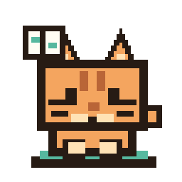

# Wiki Cat



**Wiki Cat turns knowledge management into feeding a desktop pet.**

It is a small desktop app inspired by Andrej Karpathy's LLM knowledge-base pattern: keep raw sources, curate them into Markdown, build durable wiki notes, and retrieve grounded context when asking questions. Wiki Cat wraps that workflow in a playful interaction model: drag a paper, note, link, or copied conversation onto the cat, and it becomes food for your local wiki.

The goal is simple: make an LLM-maintained knowledge base feel less like database administration and more like caring for a tiny research companion.

## What Makes It Different

- **Karpathy-style knowledge-base architecture**  
  Raw sources stay separate from curated notes. The LLM writes structured Markdown into an Obsidian-compatible wiki instead of hiding knowledge inside a chat history.

- **Desktop-pet interaction**  
  The primary ingest action is feeding the cat. Drop PDFs, Markdown files, copied text, links, or exported conversations onto the pixel pet. Wiki Cat queues them and curates them into the vault.

- **Interactive one-click deployment flow**  
  The first-run guide asks for a vault folder and a short description of your knowledge needs. It can ask your model to propose a vault architecture, let you edit it, then create the wiki structure automatically.

- **Local-first wiki management**  
  Notes are plain Markdown. The vault can be opened in Obsidian, edited by hand, synced however you like, and inspected as a real folder tree.

- **Grounded Ask mode**  
  Wiki Cat retrieves local notes and answers with source paths, so the chat layer remains tied to your wiki rather than becoming another disconnected conversation.

- **Background maintenance layer**
  After a queue finishes, Wiki Cat can run a vault pipeline that normalizes image links, refreshes source-note structure, performs second-pass concept/question distillation, updates synthesis entry points, and writes an audit report.

- **Figure-aware notes**
  Parsed PDF assets are copied into `wiki/assets/<source>/` and source notes can embed key figures with Obsidian-compatible image links.

- **Pixel-pet feedback**
  The desktop pet uses temporary pixel-style speech bubbles for queue events. During idle moments it occasionally shows short local lines, with an optional low-probability model-generated line.

## Workflow

```text
feed the cat
  -> source enters the queue
  -> parser extracts text and assets
  -> LLM curates a structured Markdown note
  -> optional maintenance normalizes links and distills graph nodes
  -> note is written into the wiki
  -> Ask mode retrieves from the wiki with citations
```

Default vault layout:

```text
wiki/
  sources/      curated source notes
  concepts/     reusable ideas and definitions
  materials/    materials, systems, datasets, entities
  methods/      methods, algorithms, protocols
  syntheses/    reviews, maps, comparisons
  questions/    open questions and follow-up tasks
raw/            original sources
ingest/         queued inputs
inbox/          untriaged notes
templates/      note templates
```

## Interface

Wiki Cat has two surfaces:

- **The desktop pet**: a small always-on-top pixel cat that accepts drag-and-drop feeding.
- **The local workbench**: a browser UI for setup, source feeding, question answering, and settings.

The pet is intentionally minimal. Settings and review controls live in the workbench so the desktop stays clean.

## Quick Start

Install dependencies:

```powershell
npm install
```

Create a local config:

```powershell
Copy-Item .\config\agent.config.example.json .\config\agent.config.json
```

Set an OpenAI-compatible API key:

```powershell
$env:OPENAI_API_KEY = "your-key"
```

Run Wiki Cat:

```powershell
npm run desktop
```

Open the workbench:

```text
http://127.0.0.1:4317
```

Build a Windows installer:

```powershell
$env:CSC_IDENTITY_AUTO_DISCOVERY = "false"
npm run dist:win
```

## Configuration

The model endpoint is OpenAI-compatible:

```json
{
  "baseUrl": "https://api.openai.com/v1/chat/completions",
  "apiKeyEnv": "OPENAI_API_KEY",
  "model": "gpt-4.1-mini"
}
```

You can point it at OpenAI, DeepSeek, Qwen-compatible gateways, local OpenAI-compatible servers, or your own proxy.

PDF parsing is optional. The open-source default keeps MinerU disabled. If you have a compatible MinerU setup, enable it in `config/agent.config.json`.

Vault maintenance is controlled by `maintenance.autoRunAfterQueue`. When enabled, maintenance waits until queued/running ingest jobs finish before running, so it does not race against note generation.

## Local Safety

- `config/agent.config.json`, `logs/`, `state/`, `dist/`, and `node_modules/` are ignored.
- Raw sources are not deleted by default.
- The agent refuses to write outside the configured vault root.
- Generated answers cite local note paths when possible.

## License

MIT
